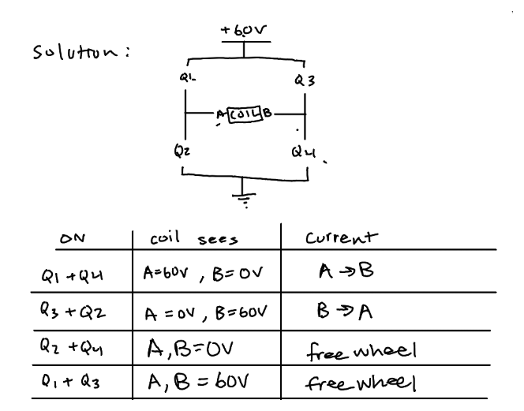

# Hyperloop Levitation Coil Driver

A two-channel H-bridge driver for the levitation coils on a hyperloop pod. It takes PWM from the
pod's control computer and switches 60 V into two coils at up to 30 A each, roughly 1.8 kW per
coil. Two boards drive the pod's four coils.

Design work for the levitation subsystem of a student hyperloop pod. The levitation team set the
requirements. The schematic, board layout, documentation and verification scripts are mine. This
repository holds the KiCad 10 project along with the design notes, the reviews, and the scripts
that check the layout.

**Status: schematic done and verified. Placement done. Routing under way. Fabrication after that.**

## Requirements

| | |
|---|---|
| Bus | 60 V max, battery fed |
| Current | 30 A per coil by design. The team's stated minimum is 60 A across all four |
| Coil | About 2 Ω and 10 mH, unmeasured |
| PWM | 16 kHz now, 32 kHz ceiling |
| Control | PID runs on a separate MCU. This board takes PWM and a shutdown line |
| Grounding | Coils float. Only common point is the motor controller negatives |
| Rails | Pod supplies 12 V, 5 V and 3.3 V |

## The board

| | |
|---|---|
| Size | 160 × 140 mm, 4 layers, 2 oz outer / 1 oz inner |
| Parts | 184 footprints, 99 nets, 492 pads |
| FETs | 8 × IRF100B201, 100 V, 4.2 mΩ, TO-220 on a shared heatsink |
| Gate drive | 4 × IR2184, bootstrap high side |
| Sensing | 0.5 mΩ shunt in line with each coil, INA240A2 amplifier |
| Protection | ±45 A window comparator into a latch on the driver shutdown pin |
| Bus | 6 × 470 µF, ceramics at each bridge, TVS clamp |
| Connectors | Molex 38969-0002, 50 A, takes 8 AWG |

## Design decisions

### Modulation

Four transistors form an H-bridge with the coil across the middle. Which pair is switched on
decides what the coil sees.



The board cycles through these states thousands of times a second. What sets the average voltage
across the coil is which states it cycles between, and how long it holds each one.

There are two ways to pick that sequence:

```
locked antiphase   Q1+Q4 -> Q2+Q3 -> Q1+Q4 -> Q2+Q3    coil sees  +60 V, -60 V, +60 V, -60 V
unipolar           Q1+Q4 -> Q1+Q3 -> Q1+Q4 -> Q1+Q3    coil sees  +60 V,   0 V, +60 V,   0 V
```

Antiphase only uses the top two rows of the table, so the coil gets slammed between +60 V and
−60 V every cycle even when you want very little current out of it. Unipolar swaps one of those
for a freewheel row, where both ends of the coil are held at the same voltage. Nothing is
pushing the current any more, so it coasts around a loop through the two transistors and fades
slowly, the way a bike wheel spins on after you stop pedalling. A switching cycle is far too
short for it to fade much. That halves the voltage swing, and at low output the coil spends most
of each cycle coasting.

That keeps the current steadier and takes a lot of strain off the bus capacitors, which is what
decided it. A levitation coil sits near zero most of the time, so low output is its normal
operating point.

The tradeoff is that the four transistors no longer share the work evenly. Two do most of it and
run hot, two do very little and stay cool. They are arranged alternately on the heatsink so no
two hot ones sit next to each other.

### Four layers

A four-layer board costs more than a two-layer one, and the usual justification for the extra
layers, less resistance in the copper, did not apply. The power traces here are already wide
enough, and a third copper layer would save about 3 W out of 54 W.

The real reason is what sits underneath the transistors. On a four-layer board a solid ground
layer sits 0.2 mm below them instead of 1.44 mm away on the other side of the board. Current
returning through that nearby layer takes a much tighter path, which shrinks the voltage spikes
the transistors see each time they switch. The same layer shields the small measurement signals
from the 30 A being chopped a couple of centimetres away.

### Current sensing

Each coil's current is measured across a very small resistor, half a milliohm, which turns 30 A
into about 15 millivolts. An amplifier scales that up fifty times to something the rest of the
circuit can work with. The resistor sits in the wire feeding the coil rather than in the ground
return, because current in a levitation coil flows in both directions and this is the only
position that sees both. TI's application note SBOA174 covers why this amplifier suits the job.

### Overcurrent protection

If coil current passes 45 A in either direction, a comparator trips and a latch shuts the gate
drivers off and holds them off until the microcontroller clears it. Without the latch the fault
would clear itself the moment current dropped, and the board would switch on and off
repeatedly. The comparator takes 1.3 microseconds to react, which sounded far too slow until I
worked out how fast the current can actually change: the coil's inductance limits it to about
13 milliamps in that time. The genuinely fast failure is both transistors in one leg turning on
together, and the gate driver chips block that on their own.

## Checking the layout

Instead of trusting measurements written down by hand, a script reads the board file and
recalculates them. Every spacing and clearance figure quoted in the documentation comes out of
it, and it runs in about a second.

```
courtyard overlaps: 0
CH1 A   12.9 mm    CH1 B   16.7 mm
CH2 A   12.9 mm    CH2 B   16.7 mm
heatsink-shadow intrusions: none
```

The wiring was also checked against the connection list exported from the schematic, separately
from KiCad's own checker, and matched exactly on all 99 nets and 492 pads. Two rules that used
to live in a document now live in the board's rule file, so the software refuses to let me break
them: high-current nets have to be poured as wide copper areas rather than drawn as thin traces,
and the inner ground layer stays solid.

## Assumptions

Some inputs to this design were never measured, so every assumption is written down with what
happens if it turns out wrong. The full list, A1 to A16, is in `docs/09_design_sheet_rev0.md`.
Three of them matter:

- **A1**: the coil is 2 Ω. If it is really 4 Ω, the board can only push half the current and the
  high-side gate drive stops working. Nobody has put a meter on it yet.
- **A9**: 60 V is the maximum, not the normal running voltage. If it is the normal voltage, a
  full battery sits closer to 67 V and the 100 V parts get uncomfortably close to their limit.
- **A16**: the power traces are 10.7 mm wide. That figure comes from an older standard, and the
  project notes already say it should be rechecked against the current one.

## Mistakes and what they changed

Every one of these was caught before it reached a manufacturer, and each one changed how the
work was checked afterwards.

**Measured the wrong thing.** Six large capacitors were supposed to fit between the two coil
connectors. Comparing the metal pads, they fit. Comparing the space each part actually needs
around it, they did not, because the connector needs far more room than its pads suggest. The
board grew from 160 × 100 to 160 × 140 mm, and I rewrote the checker to use the real keep-out
areas.

**Dropped a digit.** The board file said the copper was 0.007 mm thick instead of 0.07 mm.
Nothing inside KiCad depended on it, but it would have gone to the manufacturer, and at that
thickness the power traces would have run ten times hotter than intended.

**Trusted a number that looked deliberate.** The high-current traces were set to 3 mm wide,
which looks like a real power width. At 30 A that works out to roughly a 160 °C rise. It needed
about eight times more copper than that. The same setting had also caught ground, so all 119
ground pads inherited it.

**Reviewed in the wrong order.** Three rounds of review found 19, then 5, then 14 problems, and
about 40 % of the last round came from fixes made in the first two. Patching a design whose main
input is still unmeasured creates problems faster than review finds them, so I stopped and moved
on to layout.

## Repository layout

```
final_lev.kicad_*                KiCad project and its custom design rules
lib.pretty/                      custom connector footprint
tools/lay.py                     the layout checker
docs/00_design_log.md            running log, including the corrections
docs/01_reference_library.md     every datasheet and app note used, each one checked
docs/09_design_sheet_rev0.md     component values and the assumption list
docs/16_adversarial_review.md    38 review findings across three rounds
docs/18_firmware_interface.md    what the control microcontroller has to send
docs/20_layout_phase.md          placement and the verified clearances
docs/21_stackup_and_layers.md    layer stackup and routing order
```

## Not done

- Routing. The inner ground layer is poured, nothing else is.
- The coil has never been measured. Once it is, several numbers have to be redone together,
  because they all depend on it: ripple, transistor heating, heatsink size, gate drive supply
  and trip timing.
- Some heat calculations in `docs/09` were done under the older switching scheme.
- The bus fault detector is specified and not designed.
- `docs/09` still lists an older set of current-sense parts. The schematic is right and that
  document is stale.

## Running it

KiCad 10 on Windows. The scripts are Python 3, standard library only. From the project root:

```powershell
py tools\lay.py
```
